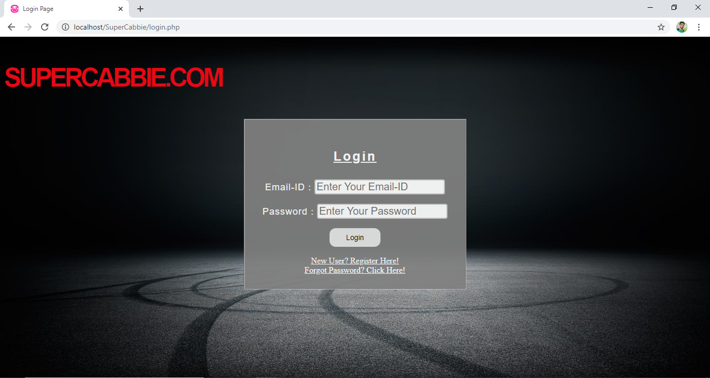
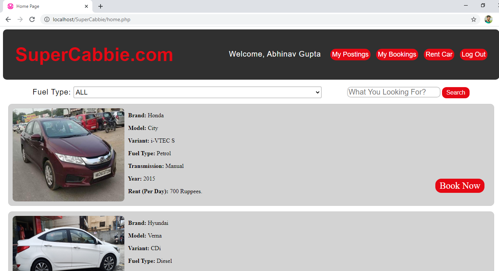
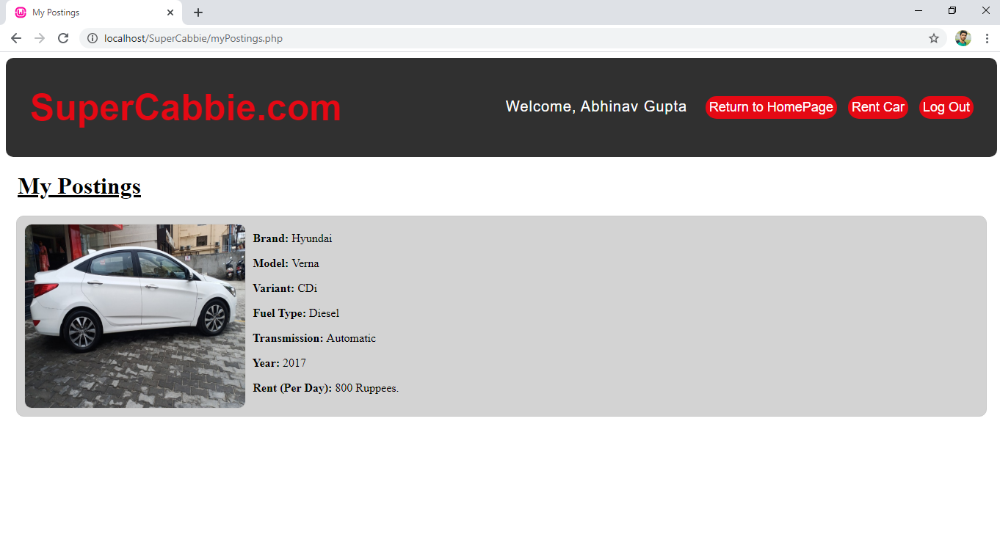
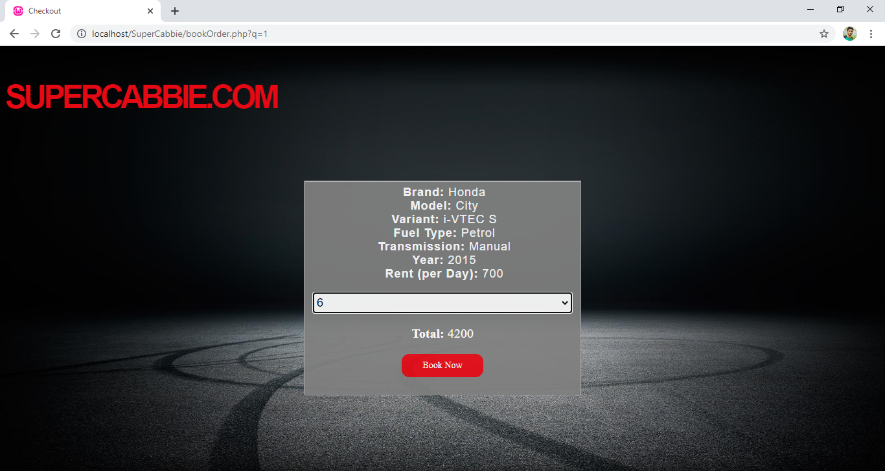

# SuperCabbie: A Car Rental Website
Submitted By: 19MCMC15  

A Car Renting Website to Rent Car.
User can also Post an Ad to Rent their Car as well as can book a Car on Rent.

# Downloading and Installation Steps:
1. Download the zip and extract SuperCabbie directory to WAMP64/WWW(for WAMP) or Similar respective folders for XAMP, LAMP or any other.
2. Run WAMP Server
3. Open PHPMyAdmin (http://localhost/phpmyadmin)
3. Create Database named <b>carrentdb</b> and import carrentdb.sql from the Database directory. (Recommended)

# Note:
It is not neccessary to create and import the above Database. 
The code can automatically create Database and Table on First Use (if already not created).
Also, a pre-defined Admin Email-ID and Password will be generated with login credentials given below.
In such case, however no User ID will be generated. So, create a user using Register Page of Website.

# Execution
Visit http://localhost/SuperCabbie/login.php in your Browser.

# Login Details:

## Admin Login Credentials:
	Email-ID: admin@supercabbie.com
	Password: abcd1234
	Mobile No.: 8950626006 (Will be used only in case of Forgot Password)

User can create their own account using Register Page.			
			OR
Can Use the below defined User-ID:
## User:
	Email-ID: dummy@gmail.com
	Password: ab12
	Mobile No.: 9876543211 (Will be used only in case of Forgot Password)	

# Features:
Basic Functionality like Login, Register, Forget are Provided.
Apart from that the following features are Provided:

## User Features:
1. Rent a Car.
2. Book a Car on Rent.
3. View 'My Postings' i.e. Posting done by that user.
4. View 'My Bookings' i.e. Car Booked on Rent by that user.
	
## Admin Features:
	Admin has all the functionality as of a simple User but also has privelged access to delete any Posting done by users.
	
# Note:
Apart from 'login.php', 'register.php' and 'forgot.php' avoid trying to open any other page using direct link i.e. without logging-in.
This may lead to some errors and website maynot work as needed.

# Screenshots:

If further some issue/query exists, please mail it to me at:
				abhinavabhi1012@gmail.com
				
				
				
Thank You!!!
